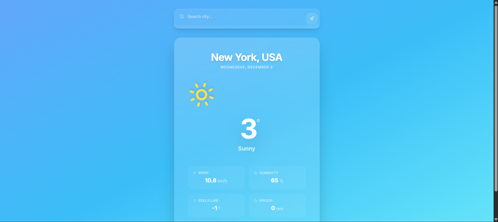

# 🌤️ SkyCast Weather


> **A real-time, immersive weather dashboard built with React 19.**

SkyCast moves beyond simple data display. It features an atmospheric UI that adapts its color palette and background animations based on the current weather conditions (Sunny, Rainy, Snowy, Night).


*(Add a screenshot of your app here named screenshot.png)*

## ✨ Features

*   **Atmospheric UI:** The background gradient and glassmorphism elements shift fluidly to match the weather (e.g., Deep purple for storms, bright cyan for clear skies).
*   **Live Data:** Fetches real-time temperature, wind, humidity, and precipitation from the [Open-Meteo API](https://open-meteo.com/).
*   **Smart Geolocation:** One-click "Use My Location" button.
*   **Global Search:** Instant lookup for any city worldwide with autocomplete-style logic.
*   **Responsive:** Fully optimized for mobile, tablet, and desktop.

## 🛠️ Tech Stack

*   **Core:** React 19, TypeScript
*   **Styling:** Tailwind CSS (Glassmorphism, Custom Animations)
*   **Icons:** Lucide React
*   **Data:** Open-Meteo API (REST)

## 🚀 Getting Started

1.  **Clone the repository**
    ```bash
    git clone https://github.com/yourusername/skycast-weather.git
    cd skycast-weather
    ```

2.  **Install dependencies**
    ```bash
    npm install
    ```

3.  **Run the application**
    ```bash
    npm start
    ```

## 📂 Project Structure

```
src/
├── components/
│   └── WeatherApp.tsx    # Main logic and UI
├── types.ts              # TypeScript interfaces
├── constants.ts          # API config and defaults
├── App.tsx               # Root component
└── index.tsx             # Entry point
```

## 🤝 Contributing

1.  Fork the Project
2.  Create your Feature Branch (`git checkout -b feature/AmazingFeature`)
3.  Commit your Changes (`git commit -m 'Add some AmazingFeature'`)
4.  Push to the Branch (`git push origin feature/AmazingFeature`)
5.  Open a Pull Request
